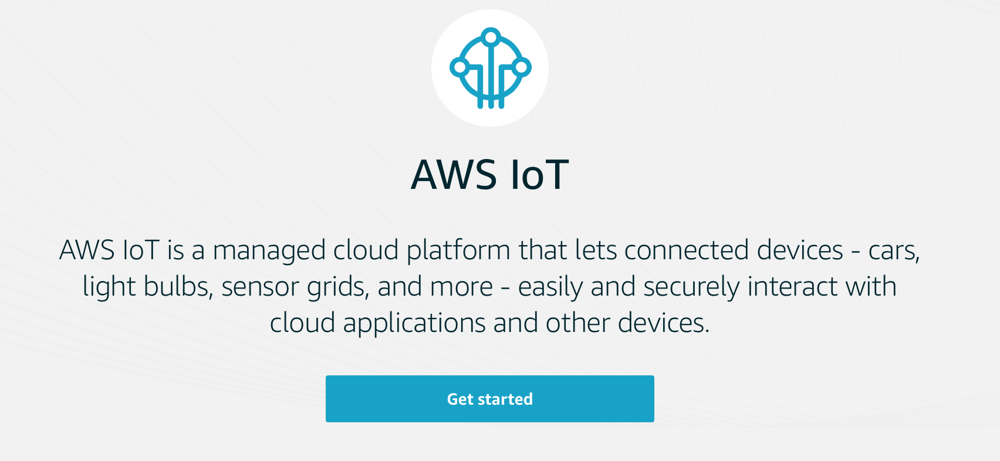
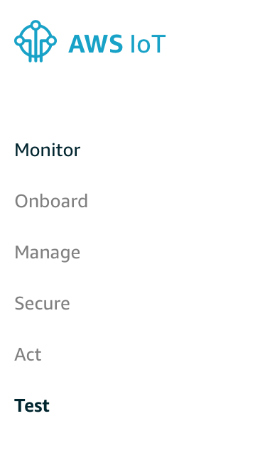
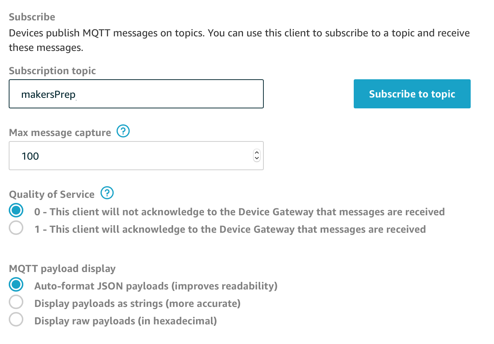
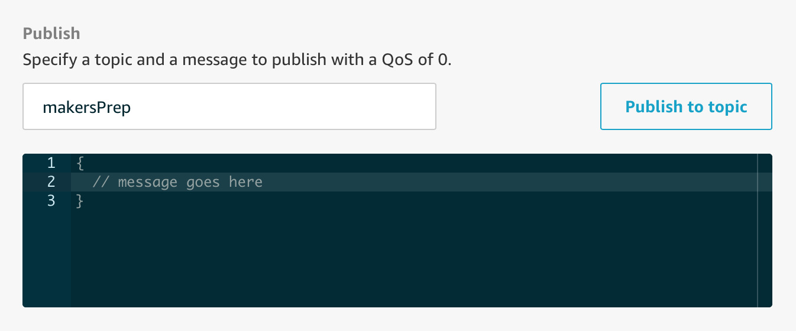

### Make: IoT Robots
# PubSub via AWS Dashboard

## Outcome

In performing this activity, you'll __subscribe and publish to a topic__ on the AWS IoT Cloud dashboard, with a __formatted JSON message__. This message will be delivered to a message queue, and then appear in your Slack team channel.

## Introduction

A **message broker** is a pub/sub service used to send and receive messages between devices and apps.

Each message is **published** to a **topic**, and the message broker then delivers those messages to all of the topic's **subscribers**. A useful analogy is a Slack channel: Each Slack channel is like a topic, and members can send (publish) messages to other members of the channel (subscribers).

The messaging protocol we will be using is MQTT, specifically version 3.1.1. In more detailed activities, you will use websockets to send and receive MQTT messages, but for now you'll use the AWS IoT dashboard to communicate with the `makersPrep` topic we've set up.

## Activity

### Step 1: Sign into AWS IoT Cloud with your maker account.

**Sign in page:** [https://offerzen-make.signin.aws.amazon.com/console](https://offerzen-make.signin.aws.amazon.com/console)
**Credentials:** These have been mailed to you.

After logging in, **ensure that you are in the Ohio region**. There's a region-select dropdown next to your name in the top right of the page.

### Step 2: Navigate to IoT Cloud's dashboard page.

  

### Step 3: In the sidebar menu, select **Test**.

  

### Step 4: Subscribe to the `makersPrep` topic.

  

### Step 5: Publish a message to the `makersPrep` topic.

  **Message format:** a JSON object with attributes:
  * `"maker"` as your Make username (this was sent to you in the prep email - it's the same as your AWS username)
  * `"completed_prep"` as `true`
  * An optional `"message"` string containing text of your choice

  This will publish an MQTT message to the `makersPrep` topic.

  If you're not sure why your message isn't working, test it with [JSON lint](https://jsonlint.com)

  

### Step 6: Check Slack!

If your message publishes sucessfully and contains the required data, **Maker Bot** on Slack will post to your team channel! 🤖🌈 If you don't see anything within a few minutes, try again or get in touch on Slack for help.

### Stuck?

_If you need help, contact [@nuclearnic](https://offerzen-make.slack.com/messages/DA5HF1659) or [@Dan](https://offerzen-make.slack.com/messages/D9M8BBRNW) on Slack._

## Extra resources
- [AWS IoT Message Broker documentation](https://docs.aws.amazon.com/iot/latest/developerguide/iot-message-broker.html)

